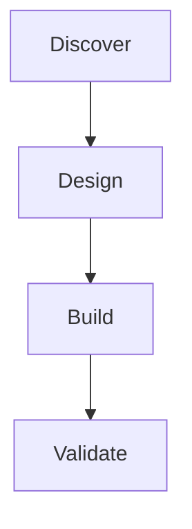

# Planning

When the user wants a **plan**, **roadmap**, **breakdown**, or **phased approach**, follow this procedure.

## 1. Clarify (only if missing)

If goal, audience, or constraints are unclear, ask **at most 2** short questions. Otherwise proceed with sensible defaults and state them.

## 2. Structure the plan

Publish one markdown artifact via **EmitArtifact** (`type: markdown`, title like `Plan — <topic>`):

```markdown
# Plan: <title>

## Goal
One paragraph.

## Scope
- In:
- Out:

## Assumptions
- …

## Phases / Tasks
### Phase 1 — …
- [ ] Task (owner?, estimate?)
### Phase 2 — …
- [ ] …

## Risks & mitigations
| Risk | Impact | Mitigation |
|------|--------|------------|
| … | … | … |

## Success criteria
- …

## Open questions
- …
```

## 3. Diagram (default on)

Include a **mermaid** flowchart or sequence diagram in the same markdown (fenced ` ```mermaid `). Prefer simple graphs:



If the user only wants a list, skip the diagram.

## 4. Delivery rules

- Use **EmitArtifact** for the full plan (not a huge fenced dump in chat).
- In the chat reply: short summary + point to the artifact.
- If they later want Excel/PDF of the plan table, use **CreateDocument**.
- Iterate: on feedback, re-EmitArtifact with the same title theme (updated content).
