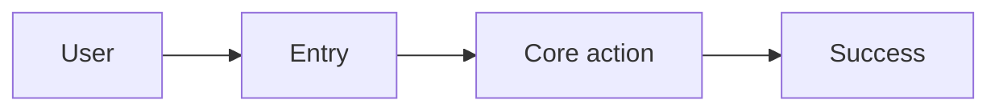

# PRD

When the user wants a **PRD**, **product spec**, **requirements doc**, or **feature brief**, follow this procedure.

## 1. Inputs

Gather (or infer and label as assumptions): product/feature name, problem, target user, constraints, success metric.

## 2. Emit the PRD

**EmitArtifact** `type: markdown`, title `PRD — <feature>` with this outline:

1. **Summary** — 2–4 sentences  
2. **Problem** — what hurts today  
3. **Goals & non-goals**  
4. **Users & scenarios** (table)  
5. **Requirements** — functional (FR-n) + non-functional (NFR-n)  
6. **User flow** — include a fenced mermaid diagram (`flowchart` or `sequenceDiagram`) unless the user declines  
7. **Edge cases & errors**  
8. **Metrics** — primary + guardrail  
9. **Rollout** — MVP steps + risks  
10. **Open questions**

Example mermaid block inside the PRD markdown:

## 3. Delivery rules

- Full body in **EmitArtifact**; chat = short executive summary only.
- Prefer mermaid for flows. UI renders mermaid fences.
- Spreadsheet of requirements matrix → **CreateDocument** format `xlsx`.
- On revision requests, re-EmitArtifact with updated content (do not only chat-diff).
